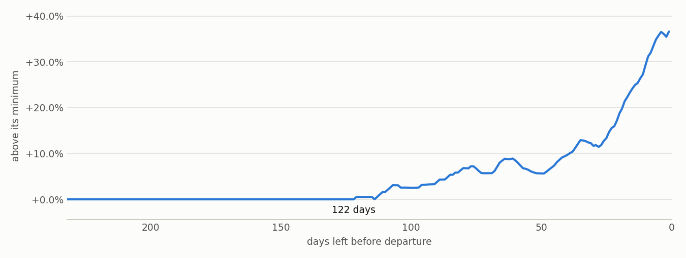

# Flight prices
Round trip, 14-day stay, 1 adult, economy. Prices from Google Flights.

_Updated 2026-11-17 07:33 (local time) · 489 checks since 2026-10-27 · 1267 price changes detected._

## Summary

- **Cheapest right now: €815** with Air Europa, Mon 29 Mar 27 → Mon 12 Apr 27.
- **Cheapest hour to check:** 05:00, on average -0.2% against that day's median price (21 days of data).
- **When prices change:** most drops are detected at 01:00 and most rises at 01:00; by weekday, drops peak on Wednesdays and rises on Tuesdays.
- **Changes with a reliable time:** 811 rises and 430 drops over 22 days of tracking.

## Cheapest dates right now

| Departure | Return | Airline | Price | Lowest seen | Highest seen |
|---|---|---|---|---|---|
| Mon 29 Mar 27 | Mon 12 Apr 27 | Air Europa | **€815** | €814 | €815 |
| Tue 30 Mar 27 | Tue 13 Apr 27 | Air Europa | **€815** | €814 | €815 |
| Wed 31 Mar 27 | Wed 14 Apr 27 | Air Europa | **€815** | €814 | €884 |
| Thu 1 Apr 27 | Thu 15 Apr 27 | Air Europa | **€815** | €814 | €815 |
| Fri 2 Apr 27 | Fri 16 Apr 27 | Air Europa | **€815** | €814 | €815 |
| Sun 4 Apr 27 | Sun 18 Apr 27 | Air Europa | **€815** | €814 | €849 |
| Sat 10 Apr 27 | Sat 24 Apr 27 | Air Europa | **€815** | €814 | €815 |
| Mon 12 Apr 27 | Mon 26 Apr 27 | Air Europa | **€815** | €814 | €815 |
| Tue 13 Apr 27 | Tue 27 Apr 27 | Air Europa | **€815** | €814 | €815 |
| Wed 14 Apr 27 | Wed 28 Apr 27 | Air Europa | **€815** | €814 | €815 |

## Price by departure date

<picture><source media="(prefers-color-scheme: dark)" srcset="charts/calendar-dark.png"></picture>

### By day of the week you leave

| Departure day | Airline | Average | Cheapest | Departures |
|---|---|---|---|---|
| Monday | Air Europa | €1,190 | €815 | 27 |
| Tuesday | Air Europa | €1,078 | €815 | 12 |
| Wednesday | Air Europa | €1,131 | €815 | 25 |
| Thursday | Air Europa | €998 | €815 | 13 |
| Friday | Air Europa | €815 | €815 | 6 |
| Saturday | Air Europa | €940 | €815 | 17 |
| Sunday | Air Europa | €1,162 | €815 | 21 |

_Averages mix seasons: a day that only has flights in low season looks cheaper on average even if it isn't within the same week._

## What time is it cheapest?

Each bar compares the price at that hour with the median of the same flight on the same day. Blue bars are hours when, on average, the flight is cheaper.

<picture><source media="(prefers-color-scheme: dark)" srcset="charts/level-by-hour-dark.png"></picture>

## When do prices change?

When each rise or drop was detected (local time). Only changes seen less than 3 hours after the previous check count.

<picture><source media="(prefers-color-scheme: dark)" srcset="charts/changes-by-hour-dark.png"></picture>

<picture><source media="(prefers-color-scheme: dark)" srcset="charts/changes-by-day-dark.png"></picture>

## How far ahead should you buy?

Median of how far above its own minimum each flight is, by days left before departure. The lowest point of the curve is the lead time at which prices tend to bottom out.

<picture><source media="(prefers-color-scheme: dark)" srcset="charts/lead-time-dark.png"></picture>

## Biggest drops in the last 7 days

| Detected | Departure | Return | Airline | Before | Now | Change |
|---|---|---|---|---|---|---|
| 2026-11-11 01:41 | Sun 15 Nov 26 | Sun 29 Nov 26 | Air Europa | €4,214 | €2,949 | -€1,265 (-30.0%) |
| 2026-11-11 18:22 | Sun 15 Nov 26 | Sun 29 Nov 26 | Air Europa | €4,089 | €2,824 | -€1,265 (-30.9%) |
| 2026-11-12 18:22 | Sun 15 Nov 26 | Sun 29 Nov 26 | Air Europa | €4,214 | €2,949 | -€1,265 (-30.0%) |
| 2026-11-13 20:22 | Sun 15 Nov 26 | Sun 29 Nov 26 | Air Europa | €4,214 | €3,434 | -€780 (-18.5%) |
| 2026-11-10 21:23 | Thu 12 Nov 26 | Thu 26 Nov 26 | Air Europa | €2,949 | €2,344 | -€605 (-20.5%) |
| 2026-11-11 01:41 | Thu 19 Nov 26 | Thu 3 Dec 26 | Air Europa | €2,824 | €2,219 | -€605 (-21.4%) |
| 2026-11-11 15:23 | Thu 19 Nov 26 | Thu 3 Dec 26 | Air Europa | €2,824 | €2,219 | -€605 (-21.4%) |
| 2026-11-13 00:22 | Thu 19 Nov 26 | Thu 3 Dec 26 | Air Europa | €2,624 | €2,019 | -€605 (-23.1%) |
| 2026-11-13 13:28 | Mon 16 Nov 26 | Mon 30 Nov 26 | Air Europa | €2,949 | €2,344 | -€605 (-20.5%) |
| 2026-11-13 16:22 | Mon 16 Nov 26 | Mon 30 Nov 26 | Air Europa | €2,949 | €2,344 | -€605 (-20.5%) |

## Biggest rises in the last 7 days

| Detected | Departure | Return | Airline | Before | Now | Change |
|---|---|---|---|---|---|---|
| 2026-11-10 20:22 | Sun 15 Nov 26 | Sun 29 Nov 26 | Air Europa | €2,824 | €4,089 | €1,265 (+44.8%) |
| 2026-11-11 14:23 | Sun 15 Nov 26 | Sun 29 Nov 26 | Air Europa | €2,824 | €4,089 | €1,265 (+44.8%) |
| 2026-11-12 17:24 | Sun 15 Nov 26 | Sun 29 Nov 26 | Air Europa | €2,949 | €4,214 | €1,265 (+42.9%) |
| 2026-11-12 19:25 | Sun 15 Nov 26 | Sun 29 Nov 26 | Air Europa | €2,949 | €4,214 | €1,265 (+42.9%) |
| 2026-11-13 17:23 | Thu 19 Nov 26 | Thu 3 Dec 26 | Air Europa | €2,019 | €2,949 | €930 (+46.1%) |
| 2026-11-14 15:22 | Sun 22 Nov 26 | Sun 6 Dec 26 | Air Europa | €2,119 | €2,824 | €705 (+33.3%) |
| 2026-11-17 00:22 | Sun 22 Nov 26 | Sun 6 Dec 26 | Air Europa | €2,219 | €2,825 | €606 (+27.3%) |
| 2026-11-10 14:23 | Wed 18 Nov 26 | Wed 2 Dec 26 | Air Europa | €2,219 | €2,824 | €605 (+27.3%) |
| 2026-11-10 23:22 | Thu 19 Nov 26 | Thu 3 Dec 26 | Air Europa | €2,219 | €2,824 | €605 (+27.3%) |
| 2026-11-11 09:25 | Thu 19 Nov 26 | Thu 3 Dec 26 | Air Europa | €2,219 | €2,824 | €605 (+27.3%) |

## Tracking status

- Air Europa, last 24 h: 25 runs, 3827 prices, 17 errors.
